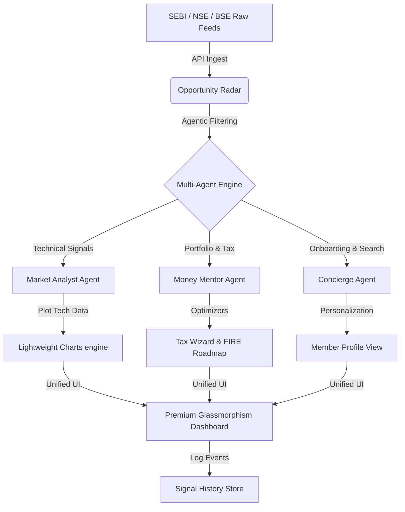

# Technical Architecture: ET Intelligence Agent Hub

This document summarizes the technical design and architectural principles behind the **ET Intelligence Agent Hub** for the **ET AI Hackathon 2026**.

## 🏗️ System Architecture & Model Diagram

## 🛠️ The Multi-Agent Core

Our solution is built on a modular "Agentic Core" designed to handle the velocity and variety of Indian market data.

### 1. Agent Roles & Responsibilities
- **Market Signal Agent**: Continuously monitors the **Opportunity Radar**. It uses pattern-matching logic to surface high-conviction trades (Insider Accumulation, Bullish Breakouts).
- **Wealth Mentor Agent**: A specialized financial planning agent that calculates tax-saving optimizations and FIRE (Financial Independence, Retire Early) trajectories.
- **Concierge Agent**: An onboarding agent that builds a persistent **Investor Profile** to personalize the dashboard and content discovery.

### 2. High-Fidelity Tool Integrations
- **Charting Tool**: Integrated **TradingView Lightweight Charts (v5.1.0)**.
- **Iconography Tool**: **Lucide React** for semantic visual cues.
- **Design Tool**: Custom **Vanilla CSS Design System** (Glassmorphism, Dark-mode-first).

### 3. State & Persistence Hub
- **Simulated Auth Context**: Manages member sessions and "Logged In" status app-wide.
- **Signal History Log**: A persistent record of all historical signals captured by the agents, ensuring no actionable insight is lost.

## 🤝 Agent Communication Logic
1. **Event Bubbling**: When the **Radar Agent** detects an "Insider Buy" at 10:15 AM, it triggers a `signalHistory` update in the **Global Context**.
2. **Dynamic UI Adaptation**: The **Concierge Agent** reads the `AuthContext` to determine if the user is an "ET Prime" member, which unlocks the **Money Mentor's** deep-dive tax logic.

## 🛡️ Error Handling & SEBI Compliance
- **Reasoning Guardrails**: Every "Signal" includes an **"Agent's Rationale"** (Source Cited) to ensure transparency.
- **SEBI Compliant Reasoning**: Our **Money Mentor Agent** is programmed to provide "Reasoning-only" outputs to avoid providing unauthorized financial advice.
- **Fallback Logic**: If the charting component fails to load, a static summary of the trend is rendered as a graceful fallback.

---

**Generated for ET AI Hackathon 2026 Submission**
